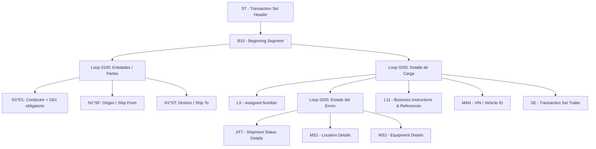

# 🚚 Rivian EDI 214 — Transportation Carrier Shipment Status Message

## 📌 Visión General
El documento **RIVIAN-EDI-214-V4010-v1.5_Outbound.pdf** es la guía de implementación oficial de Rivian Automotive para la transacción EDI 214 (*Transportation Carrier Shipment Status Message*), basada en el estándar **ANSI X12 Versión 4010** y el grupo funcional **QM**.

Este mensaje es enviado por los **transportistas (Carriers)** hacia Rivian para reportar en tiempo real los hitos geográficos, eventos de transporte, estados de carga/descarga e identificadores de envío durante el tránsito de los vehículos o materiales.

---

## 🏗️ Estructura Principal del Documento

---

## 🔑 Segmentos Clave y Campos Requeridos

### 1. `B10` — Beginning Segment
- **B1001** (`Reference Identification`): Número de factura / PRO asignado por el transportista.
- **B1002** (`Shipment Identification Number`): Número de envío asignado por Rivian (*Shipment ID*).
- **B1003** (`SCAC`): Standard Carrier Alpha Code del transportista (2–4 caracteres).

### 2. `Loop 0100` — Identificación de Partes (`N1`, `N3`, `N4`, `G61`)
- **`N1*D1`** (Driver): Identifica al conductor. **REGLA:** Al usar `D1`, es **estrictamente obligatorio** incluir inmediatamente un segmento `G61*IC` con el nombre de contacto y teléfono.
- **`N1*SF`** (Ship From): Lugar de origen / recogida.
- **`N1*ST`** (Ship To): Lugar de destino / entrega.

### 3. `AT7` — Detalles de Estado del Envío (`Loop 0205`)
Especifica el tipo de evento, fecha, hora y zona horaria (UTC):
- **AT701**: Código de evento (*Shipment Status Code*).
- **AT702**: Código de razón (*Status Reason Code*).
- **AT705 / AT706 / AT707**: Fecha (`CCYYMMDD`), Hora (`HHMMSS`) y Código de tiempo (`UT`).

### 4. `MS1` / `MS2` — Ubicación y Equipo
- **`MS1`**: Ubicación geográfica (Ciudad, Estado, País) o coordenadas GPS (Lat/Long con indicadores N/S, E/W).
- **`MS2`**: SCAC (`MS201`) y Número de Equipo / Tráiler (`MS202`). **REGLA:** Si se envía `MS201`, `MS202` es obligatorio.

### 5. `L11` — Referencias de Negocio
- **`L11*6W`**: Sequence Number.
- **`L11*LO`**: Load Planning Number.
- **`L11*QN`**: **Stop Sequence Number**.
  - `1` = Puntos de recogida (*Pick up Points*).
  - `2` = Puntos de entrega (*Drop off Points*).

### 6. `MAN` — Marks and Numbers
- **`MAN*VI`**: Número de Identificación del Vehículo (**VIN**). **REGLA:** Obligatorio en el Loop 0200 con el calificador `VI`.

---

## ⚡ Códigos de Evento Obligatorios (`AT701`)

Rivian acepta códigos estándar, pero exige la transmisión obligatoria de los siguientes 8 hitos:

| Código | Descripción en Español | Tipo de Parada (`QN`) |
| :---: | :--- | :---: |
| **`E1`** | Estimated Time of Arrival at Origin for Pickup | `1` (Origen) |
| **`X3`** | Arrived at Pick-up Location | `1` (Origen) |
| **`AF`** | Carrier Departed Pick-up Location with Shipment | `1` (Origen) |
| **`X6`** | En Route to Delivery Location | `2` (Destino) |
| **`X2`** | Estimated Date/Time of Arrival at Consignee | `2` (Destino) |
| **`X1`** | Arrived at Delivery Location | `2` (Destino) |
| **`D1`** | Completed Unloading at Delivery Location | `2` (Destino) |
| **`AP`** | Delivery Not Completed (Intento fallido / Excepción) | `2` (Destino) |

---

## 🚨 Reglas Críticas de Validación

1. **Sin separadores vacíos al final (`*~` o `+~`)**: No dejar delimitadores sobrantes antes de la tilde de cierre `~`.
2. **`G61` obligatorio con `N1*D1`**: Debe incluir nombre (`G6102`) y teléfono (`G6104`) con calificador `TE`. *(Se permite usar teléfono corporativo/despacho).*
3. **`MS202` obligatorio con `MS201`**: No dejar el número de equipo vacío si se envía el SCAC.
4. **Correspondencia de Parada (`QN`)**:
   - Eventos de origen (`E1`, `X3`, `AF`) → `L11*1*QN`
   - Eventos de destino (`X6`, `X2`, `X1`, `D1`, `AP`) → `L11*2*QN`
5. **Conteo exacto en `SE01`**: Debe contar todas las líneas desde `ST` hasta `SE` inclusive.

---

## 📝 Historial de Revisiones Destacadas

- **v1.1**: Actualización de calificadores de referencia `L1102` (`6W`, `LO`).
- **v1.2**: Incorporación de calificador `QN` para `L1102`.
- **v1.3**: Actualización de eventos obligatorios en `AT701`.
- **v1.4**: Inclusión del elemento `MS1.07`.
- **v1.5 (2025-04-30)**: Adición del nuevo código de evento obligatorio **`X6`** en `AT701`.
